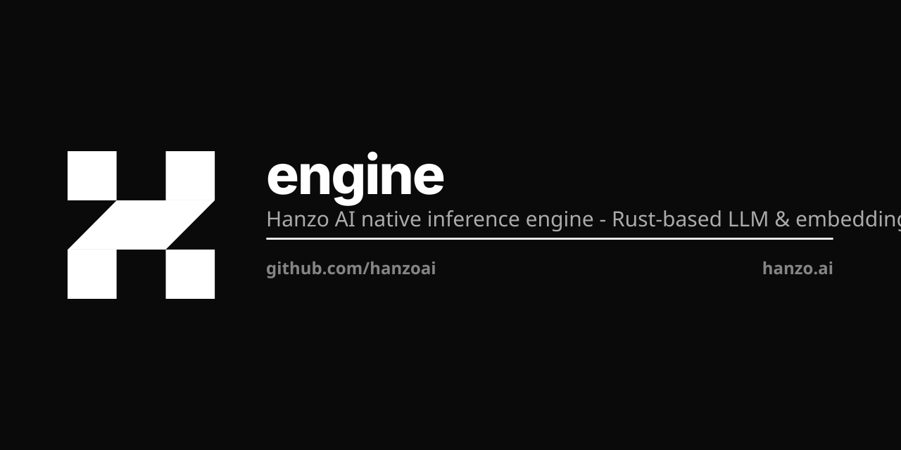

<a name="top"></a>
<p align="center"></p>

<div align="center">
  
</div>

<h1 align="center">Hanzo Engine</h1>

<h3 align="center">
The native, multimodal inference engine — text, vision, audio, speech, image, and embeddings in one fast Rust binary.
</h3>

<p align="center">
  | <a href="https://hanzoai.github.io/engine/"><b>Documentation</b></a> | <a href="https://crates.io/crates/hanzo"><b>Rust SDK</b></a> | <a href="https://hanzoai.github.io/engine/tutorials/03-python-sdk/"><b>Python SDK</b></a> | <a href="https://discord.gg/SZrecqK8qw"><b>Discord</b></a> |
</p>

<p align="center">
  <a href="https://github.com/hanzoai/engine/stargazers">
    
  </a>
</p>

<p align="center"><sub>Forked from <a href="https://github.com/EricLBuehler/mistral.rs"><b>EricLBuehler/mistral.rs</b></a> (MIT).</sub></p>

Hanzo Engine runs any Hugging Face model with zero config, quantizes it for your hardware, and serves it over the OpenAI and Anthropic wire formats plus a built-in web UI — one binary, from your laptop to a GPU cluster. It is the native inference layer of the [Open AI Cloud](https://hanzo.ai).

## Latest

- **Qwen3-Omni**: native end-to-end omni-modal model (understand → think → speak) — text/image/video/audio in, text + 24kHz speech out, through one extensible modality pipeline. Validated against the reference weights.
- **New frontier models**: MiniMax-M2 (sparse-MoE) and DeepSeek-V3.2, alongside the existing DeepSeek-V3, Kimi-K2, GLM-4, and Qwen3 families. [Supported models](https://hanzoai.github.io/engine/reference/supported-models/)
- **Paged-attention serving** for the omni Thinker, plus a **disk-first KV cache** (cross-restart sessions + agent prefix reuse) for cheap long-context serving.
- **Anthropic Messages API**: `hanzo-engine serve` now exposes an Anthropic-compatible `POST /v1/messages` endpoint (streaming, tool use, and Claude Code harness support) alongside the OpenAI-compatible `/v1` API. [Examples](examples/server/)
- **Agentic runtime**: web search, local Python code execution with model feedback, session management, and custom tool hooks. [Guide](https://hanzoai.github.io/engine/tutorials/05-build-an-agent/)
- **Gemma 4**: full multimodal: text, image, video, and audio input. [Guide](https://hanzoai.github.io/engine/reference/supported-models/) | [Video setup](https://hanzoai.github.io/engine/guides/models/video-setup/)
- **MXFP4 ISQ quantization**: MXFP4 with optimized decode kernels for faster, smaller models. [Quantization docs](https://hanzoai.github.io/engine/reference/quantization-types/)

## Why Hanzo Engine?

- **Any Hugging Face model, zero config**: Just `hanzo-engine run -m user/model`. Architecture, quantization format, and chat template are auto-detected.
- **True multimodality**: Text, vision, video, and audio, speech generation, image generation, and embeddings in one engine.
- **Smart quantization**: `--quant` automatically selects the best quantization format at that level: using a prebuilt UQFF if one is published, otherwise applying ISQ. [Docs](https://hanzoai.github.io/engine/tutorials/06-quantize-a-model/)
- **OpenAI + Anthropic wire formats**: The same `hanzo-engine serve` process exposes OpenAI-compatible `/v1` endpoints and an Anthropic-compatible Messages endpoint.
- **Built-in web UI**: Served at `/ui` by default. Shows reasoning, code execution, plots, and files inline. Edit any message and the new branch runs with its own Python state. Pass `--no-ui` to disable.
- **Hardware-aware**: `hanzo-engine tune` benchmarks your system and picks optimal quantization + device mapping.
- **Flexible SDKs**: Python package and Rust crate to build your projects.
- **Native agentic support**: built-in [agentic loop](https://hanzoai.github.io/engine/guides/agents/) with web search, local Python code execution with model feedback, session management, and custom tool hooks.

## Quick Start

### Binaries

This repository builds two programs, and neither is called `hanzo`:

| binary | crate | how to get it |
|---|---|---|
| `hanzoai` | `hanzo-server` | prebuilt, attached to each [release](https://github.com/hanzoai/engine/releases/latest) |
| `hanzo-engine` | `hanzo-cli` | built from source by `install.sh` |

The `hanzo` on your PATH is the [Hanzo CLI](https://github.com/hanzoai/cli); its `hanzo engine serve MODEL` runs `hanzo-engine serve -m MODEL`. `hanzoai` logs a deprecation warning that names `hanzo serve` from hanzo-cli, which is the `hanzo-engine` binary.

Release v1.7.92 carries `hanzoai-macos-arm64.tar.gz` and `hanzoai-macos-amd64.tar.gz` (Metal), and `hanzoai-linux-amd64.tar.gz` and `hanzoai-linux-arm64.tar.gz` (CPU only, with cosign `.sig` and `.pem`). Each tarball holds the one `hanzoai` binary.

`install.sh` needs Rust 1.88 or newer. It runs `cargo install --git https://github.com/hanzoai/engine --locked hanzo-cli` with the features it detects, which puts `hanzo-engine` in `~/.cargo/bin`:

```bash
curl --proto '=https' --tlsv1.2 -sSf https://raw.githubusercontent.com/hanzoai/engine/main/install.sh | sh
```

**Windows (PowerShell):**
```powershell
irm https://raw.githubusercontent.com/hanzoai/engine/main/install.ps1 | iex
```

[Manual installation & other platforms](https://hanzoai.github.io/engine/guides/install/)

### Serve a model

```bash
curl -L https://github.com/hanzoai/engine/releases/latest/download/hanzoai-macos-arm64.tar.gz | tar xz
./hanzoai --serve-ip 127.0.0.1 --port 1234 run -m zenlm/zen-nano-0.6b
```

From another shell:

```bash
curl 127.0.0.1:1234/v1/models
```

`hanzoai` has no default port: give it `--port`, or `-i` for an interactive session. `--serve-ip` defaults to `0.0.0.0`, every interface. OpenAI-compatible clients use `http://127.0.0.1:1234/v1`.

`hanzo-engine serve -m <model>` listens on `0.0.0.0:1234` unless given `-p` and `--host`, serves a web UI at `/ui`, and advertises itself over mDNS unless given `--no-advertise`. LM Studio also defaults to port 1234. `hanzo-engine tune -m <model> --emit-config config.toml` recommends a quantization and device map for the machine, and `hanzo-engine from-config -f config.toml` runs it.

### Chat and embeddings on one port

`multi-model` serves several models on one port, and each request names one by `alias`. With this `models.json`:

```json
{
  "chat": { "alias": "chat", "Plain": { "model_id": "zenlm/zen-nano-0.6b" } },
  "embed": { "alias": "embed", "Embedding": { "model_id": "zenlm/zen-embedding-0.6B" } }
}
```

```bash
./hanzoai --serve-ip 127.0.0.1 --port 1234 multi-model --config models.json
```

```bash
curl 127.0.0.1:1234/v1/embeddings -H 'Content-Type: application/json' \
  -d '{"model":"embed","input":"hello"}'
curl 127.0.0.1:1234/v1/chat/completions -H 'Content-Type: application/json' \
  -d '{"model":"chat","messages":[{"role":"user","content":"hello"}]}'
```

### Memory

Weights take about their file size in memory. Weight files of Zen models in GB (10^9 bytes), as the Hugging Face API lists them (`/api/models/<repo>?blobs=true`). The 16-bit column is the safetensors release; Q8_0 and Q4_K_M are GGUF files, from the `-GGUF` repos for the embedding models.

| model | parameters | 16-bit | Q8_0 | Q4_K_M |
|---|---|---|---|---|
| `zenlm/zen-nano-0.6b` | 0.60 B | 1.19 | 0.64 | 0.40 |
| `zenlm/zen-embedding-0.6B` | 0.60 B | 1.19 | 0.64 | |
| `zenlm/zen-eco-4b-instruct` | 4.02 B | 8.04 | | |
| `zenlm/zen-embedding-8B` | 7.57 B | 15.13 | | 4.68 |
| `zenlm/zen-vl-8b-instruct` | 8.77 B | 17.53 | | |

That is about 2.0 GB per billion parameters at 16 bits, 1.07 GB at Q8_0 and 0.62 GB at Q4_K_M, so a 14B model needs roughly 28, 15 or 8.7 GB for weights. `hanzoai --isq q8_0` or `--isq q4k` quantizes a 16-bit model as it loads.

The KV cache comes on top: 2 × layers × KV heads × head dim × 2 bytes per token at 16 bits. With the values in each `config.json`, `zen-nano-0.6b` (28 × 8 × 128) takes 0.11 MB per token and `zen-eco-4b-instruct` (36 × 8 × 128) 0.15 MB, so a 32,768-token context adds 3.8 or 4.8 GB. The automatic device map plans for `--max-seq-len`, 4096 tokens unless set.

Measured on a 64 GB M1 Max with `vmmap -summary`: `zen-nano-0.6b` at 16 bits served with a 2.0 GB physical footprint, and 3.6 GB with `zen-embedding-0.6B` loaded beside it.

On Apple Silicon the GPU budget is the larger of Metal's recommended working set and 2/3 of RAM (3/4 above 36 GB), or `sysctl iogpu.wired_limit_mb` when that is set (`hanzo-engine/src/utils/memory_usage.rs`). For the 64 GB M1 Max above the device map reported 52 GB. On a 24 GB Mac the budget starts at 16 GB, about what a 14B model at Q8_0 needs for weights alone.

[Full CLI documentation](https://hanzoai.github.io/engine/reference/cli/)

<details open>
  <summary><b>UI Demo</b></summary>
  <br>
  
</details>

## What Makes It Fast

**Performance**
- Continuous batching support by default on all devices.
- CUDA with [FlashAttention](https://hanzoai.github.io/engine/guides/perf/use-flash-attention/) V2/V3, Metal, [multi-GPU tensor parallelism](https://hanzoai.github.io/engine/guides/perf/multi-gpu-tensor-parallel/)
- [PagedAttention](https://hanzoai.github.io/engine/guides/perf/use-paged-attention/) for high throughput continuous batching on CUDA or Apple Silicon, prefix caching (including multimodal)

**Quantization** ([full docs](https://hanzoai.github.io/engine/reference/quantization-types/))
- [In-situ quantization (ISQ)](https://hanzoai.github.io/engine/guides/perf/pick-a-quantization/) of any Hugging Face model
- GGUF (2-8 bit), GPTQ, AWQ, HQQ, FP8, BNB support
- ⭐ [Per-layer topology](https://hanzoai.github.io/engine/guides/perf/topology/): Fine-tune quantization per layer for optimal quality/speed
- ⭐ Auto-select fastest quant method for your hardware

**Flexibility**
- [LoRA & X-LoRA](https://hanzoai.github.io/engine/guides/customize/lora-adapters/) with weight merging
- [AnyMoE](https://hanzoai.github.io/engine/guides/customize/anymoe/): Create mixture-of-experts on any base model
- [Multiple models](https://hanzoai.github.io/engine/guides/serve/multiple-models/): Load/unload at runtime

**Agentic Features**
- Integrated [tool calling](https://hanzoai.github.io/engine/guides/agents/tool-calling-basics/) with grammar enforcement and strict schema mode
- ⭐ Server-side [agentic loop](https://hanzoai.github.io/engine/guides/agents/configure-tool-loop/): auto-execute tools and feed results back
- ⭐ [Python code execution](https://hanzoai.github.io/engine/guides/agents/enable-code-execution/): persistent Jupyter-like sessions with matplotlib capture and multimodal feedback
- ⭐ [Web search integration](https://hanzoai.github.io/engine/guides/agents/web-search/) with embedding-based ranking
- ⭐ [Tool dispatch URL](https://hanzoai.github.io/engine/guides/agents/configure-tool-loop/): POST tool calls to your own endpoint
- ⭐ [MCP client](https://hanzoai.github.io/engine/guides/agents/connect-mcp-server/): Connect to external tools via Process, HTTP, or WebSocket
- Python/Rust [tool callbacks](https://hanzoai.github.io/engine/guides/agents/tool-calling-basics/) for custom execution

[Full feature documentation](https://hanzoai.github.io/engine/)

## Supported Models

<details>
<summary><b>Text Models</b></summary>

- Granite 4.0
- SmolLM 3
- DeepSeek V3
- GPT-OSS
- DeepSeek V2
- Qwen 3 Next
- Qwen 3 MoE
- Phi 3.5 MoE
- Qwen 3
- GLM 4
- GLM-4.7-Flash
- GLM-4.7 (MoE)
- Gemma 2
- Qwen 2
- Starcoder 2
- Phi 3
- Mixtral
- Phi 2
- Gemma
- Llama
- Mistral
</details>

<details>
<summary><b>Multimodal Models</b></summary>

- Qwen 3.5
- Qwen 3.5 MoE
- Qwen 3-VL
- Qwen 3-VL MoE
- Gemma 3n
- Llama 4
- Gemma 3
- Mistral 3
- Phi 4 multimodal
- Qwen 2.5-VL
- MiniCPM-O
- Llama 3.2 Vision
- Qwen 2-VL
- Idefics 3
- Idefics 2
- LLaVA Next
- LLaVA
- Phi 3V
</details>

<details>
<summary><b>Speech Models</b></summary>

- Voxtral (ASR/speech-to-text)
- Dia
</details>

<details>
<summary><b>Image Generation Models</b></summary>

- FLUX
</details>

<details>
<summary><b>Embedding Models</b></summary>

- Embedding Gemma
- Qwen 3 Embedding
</details>

[Request a new model](https://github.com/hanzoai/engine/issues/156) | [Full compatibility tables](https://hanzoai.github.io/engine/reference/supported-models/)

## Python SDK

```bash
pip install hanzo  # or hanzo-cuda, hanzo-metal, hanzo-mkl, hanzo-accelerate
```

```python
from hanzo import Runner, Which, ChatCompletionRequest

runner = Runner(
    which=Which.Plain(model_id="Qwen/Qwen3-4B"),
    in_situ_quant="4",
)

res = runner.send_chat_completion_request(
    ChatCompletionRequest(
        model="default",
        messages=[{"role": "user", "content": "Hello!"}],
        max_tokens=256,
    )
)
print(res.choices[0].message.content)
```

[Python SDK](https://hanzoai.github.io/engine/tutorials/03-python-sdk/) | [Installation](https://hanzoai.github.io/engine/guides/install/) | [Examples](examples/python) | [Cookbook](examples/python/cookbook.ipynb)

## Rust SDK

```bash
cargo add hanzo
```

```rust
use anyhow::Result;
use hanzo::{IsqType, TextMessageRole, TextMessages, MultimodalModelBuilder};

#[tokio::main]
async fn main() -> Result<()> {
    let model = MultimodalModelBuilder::new("google/gemma-4-E4B-it")
        .with_isq(IsqType::Q4K)
        .with_logging()
        .build()
        .await?;

    let messages = TextMessages::new().add_message(
        TextMessageRole::User,
        "Hello!",
    );

    let response = model.send_chat_request(messages).await?;

    println!("{:?}", response.choices[0].message.content);

    Ok(())
}
```

[API Docs](https://docs.rs/hanzo) | [Crate](https://crates.io/crates/hanzo) | [Examples](hanzo/examples)

## Docker

For quick containerized deployment:

```bash
docker pull ghcr.io/hanzoai/engine:latest
docker run --gpus all -p 1234:1234 ghcr.io/hanzoai/engine:latest \
  serve -m Qwen/Qwen3-4B
```

[Docker images](https://github.com/hanzoai/engine/pkgs/container/hanzo)

> For production use, we recommend installing the CLI directly for maximum flexibility.

## Documentation

For complete documentation, see the **[Documentation](https://hanzoai.github.io/engine/)**.

**Quick Links:**
- [CLI Reference](https://hanzoai.github.io/engine/reference/cli/) - All commands and options
- [HTTP API](https://hanzoai.github.io/engine/reference/http-api/) - OpenAI-compatible `/v1` endpoints
- [Quantization](https://hanzoai.github.io/engine/reference/quantization-types/) - ISQ, GGUF, GPTQ, and more
- [Device Mapping](https://hanzoai.github.io/engine/explanation/device-mapping/) - Multi-GPU and CPU offloading
- [MCP Integration](https://hanzoai.github.io/engine/guides/agents/connect-mcp-server/) - MCP integration documentation
- [Troubleshooting](https://hanzoai.github.io/engine/reference/troubleshooting/) - Common issues and solutions
- [Configuration](https://hanzoai.github.io/engine/reference/environment-variables/) - Environment variables for configuration

## Contributing

Contributions welcome! Please [open an issue](https://github.com/hanzoai/engine/issues) to discuss new features or report bugs. If you want to add a new model, please contact us via an issue and we can coordinate.

## Credits

Built on the excellent open-source work of [mistral.rs](https://github.com/EricLBuehler/mistral.rs) (MIT) and [candle](https://github.com/huggingface/candle) (MIT OR Apache-2.0), which we consume through our fork [hanzoai/ml](https://github.com/hanzoai/ml). Thank you to all [contributors](https://github.com/hanzoai/engine/graphs/contributors)!

Hanzo Engine is not affiliated with Mistral AI.

## Hanzo — the Open AI Cloud

Open source · every language · on-chain settlement. [hanzo.ai](https://hanzo.ai) · [docs.hanzo.ai](https://docs.hanzo.ai)

**SDKs in every language** — [Python](https://github.com/hanzoai/python-sdk) (flagship) · [TypeScript](https://github.com/hanzo-js/sdk) · [Go](https://github.com/hanzo-go/sdk) · [Rust](https://github.com/hanzo-rs/sdk) · [C++](https://github.com/hanzo-cpp/sdk) · [Swift](https://github.com/hanzo-swift/sdk) · [Kotlin](https://github.com/hanzo-kt/sdk) · [umbrella](https://github.com/hanzoai/sdk)
